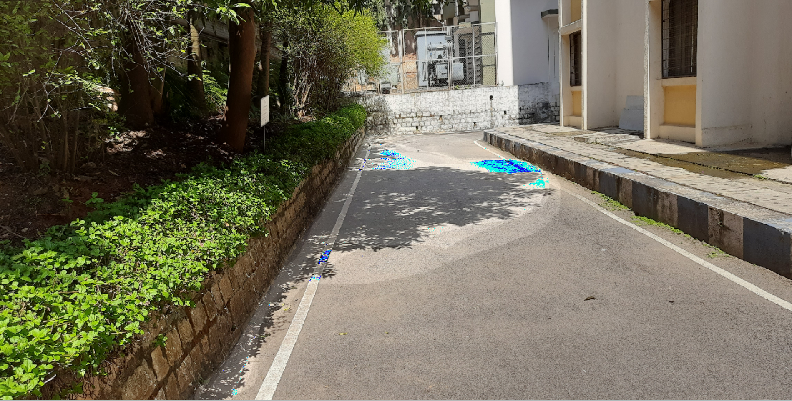
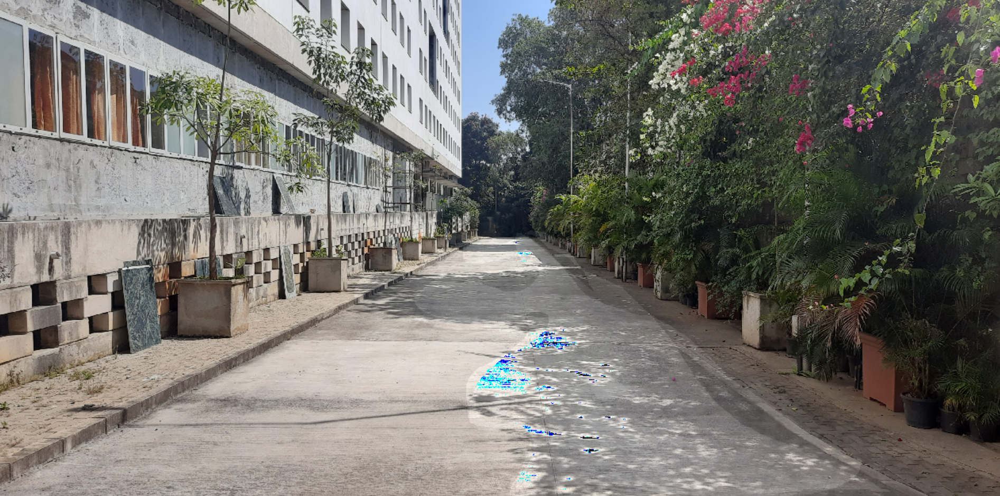

# OpenCV Shadow Removal
<u><b>Approach 1:</b></u>
<u><b>Mouse Callback Function:</b></u>
<ul>
 <li>Handles mouse events such as button down, mouse movement, and button up.</li>
 <li>When the left mouse button is pressed down, it starts drawing by adding the current point to the list.</li>
 <li>During mouse movement, if drawing is in progress, it continues to append points to the list.</li>
 <li>When the left mouse button is released, drawing is stopped, and the last point is added to the list.</li>
 <li>Calls fill_polygon function after drawing.</li>
</ul>
<u><b>fill_polygon Function:</b></u>
<ul>
 <li>Creates a binary mask for the polygon using the list of points.</li>
 <li>Increases the brightness of the pixels inside the polygon in the original image.</li>
</ul>

<u><b>Image Reading and Window Setup:</b></u>
<ul>
 <li>Reads an image.</li>
 <li>Sets up a window named 'Image' and associates the mouse callback function.</li>
</ul>

<b>Picture 1:</b> 

<b>Picture 2:</b> 

  

<u>Approach 2:</u>
•	The code allow the user to draw a polygon on an input image by clicking and dragging the mouse.
•	The drawn polygon is then used to create a region of interest (ROI) on the image.
•	A grayscale version of the ROI is thresholded to create a binary mask, highlighting certain areas of interest.
•	A road mask is created based on the drawn polygon, and this mask is applied to the original image.
•	The result is displayed in a window ,showing the original image with the specified region masked in a different color.

Picture 1:
Masked shadow region:
 

Final image masked with different color:
 

Picture 2:
Masked shadow region:
 

Final image masked with different color:
 
This is the final improvement I have done
